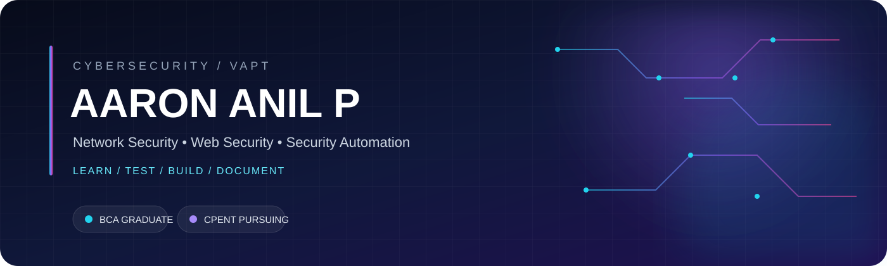

 

## 01 / WHO I AM

<table>
<tr>
<td width="62%" valign="top">

### Hey, I'm Aaron.

I'm a **BCA graduate** building my career in cybersecurity, with my current direction centered on **Vulnerability Assessment & Penetration Testing**, supported by network and web application security.

I’m deliberately building from fundamentals instead of trying to look more experienced than I am.

**My working loop**

UNDERSTAND → TEST → VALIDATE → DOCUMENT → BUILD

I learn through controlled environments, technical notes and small projects that force me to explain why something works — not just remember a command.

</td>
<td width="38%" valign="top">

### CURRENT FOCUS

**01 — VAPT**  
Reconnaissance · Enumeration · Validation

**02 — NETWORK**  
TCP/IP · Services · Protocols · Traffic

**03 — WEB**  
HTTP/S · OWASP · Burp Suite

**04 — AUTOMATION**  
Python · Nmap · Structured findings

</td>
</tr>
</table>

---

---

## 02 / WHAT I'M BUILDING

<table>
<tr>
<td width="70%" valign="top">

### ◈ DREAPER

**Network Reconnaissance & Vulnerability Analysis**

A Python-based security project I'm building to turn Nmap reconnaissance into something easier to analyze.

The idea is intentionally practical:

- **Discover** exposed ports and services
- **Parse** reconnaissance output
- **Identify** service/version information
- **Correlate** findings with vulnerability intelligence
- **Present** results in a useful assessment format

**Status:** IN DEVELOPMENT

The project will evolve as I learn. I’m treating the implementation, testing and documentation as part of the learning process rather than presenting an unfinished tool as a finished product.

</td>
<td width="30%" align="center" valign="middle">

### PIPELINE

🔎  
**DISCOVER**

↓

🧩  
**PARSE**

↓

🧠  
**CORRELATE**

↓

📋  
**REPORT**

</td>
</tr>
</table>

---

## 03 / SECURITY TOOLKIT

| RECON | WEB | ANALYSIS | BUILD |
|:---:|:---:|:---:|:---:|
| **Nmap** | **Burp Suite** | **Wireshark** | **Python** |
| Port discovery | HTTP testing | Packet analysis | Automation |
| Enumeration | OWASP testing | Traffic analysis | Scripting |
| Version detection | Request analysis | Network visibility | Tooling |

 

---

## 04 / KNOWLEDGE MAP

<table>
<tr>
<td width="50%" valign="top">

### NETWORK SECURITY

- TCP/IP fundamentals
- OSI model
- DNS
- HTTP / HTTPS
- SSH
- FTP / SFTP
- SMB
- LDAP
- Kerberos
- Network reconnaissance
- Service enumeration

</td>
<td width="50%" valign="top">

### APPLICATION SECURITY

- OWASP methodology
- HTTP request / response analysis
- Authentication testing
- Authorization testing
- Common web vulnerabilities
- Burp Suite workflows
- Vulnerability validation
- Security reporting

</td>
</tr>
</table>

---

## 05 / LEARNING RIGHT NOW

| AREA | DIRECTION |
|:---|:---|
| 🔭 **Recon & Enumeration** | Building stronger fundamentals and repeatable workflows |
| 🌐 **Web Security** | Practising HTTP analysis and OWASP-oriented testing |
| 🐍 **Python Security Automation** | Building Dreaper and learning by implementation |
| 🛡️ **VAPT Methodology** | Moving from individual techniques toward complete assessments |
| 🧪 **Controlled Labs** | Testing, validating and documenting findings |
| 🎓 **CPENT** | Preparing through hands-on security practice |

---

## 06 / CERTIFICATION PATH

**CEH** · Completed &nbsp;&nbsp; **CSA** · Completed &nbsp;&nbsp; **CPENT** · Pursuing

> Certifications are part of the journey. The bigger goal is being able to demonstrate the underlying skill without relying on the certificate.

---

## 07 / THE ROAD AHEAD

### FROM LEARNING → TO EVIDENCE

I’m building this profile around one simple principle:

**Don't just collect knowledge. Leave evidence behind.**

That means turning learning into:

LABS → NOTES → TOOLS → PROJECTS → REPORTS

As those pieces become real, this profile will evolve with them.

 

  

