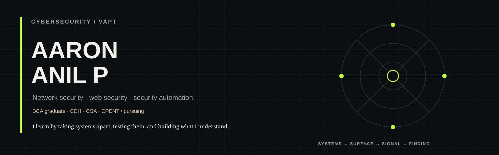
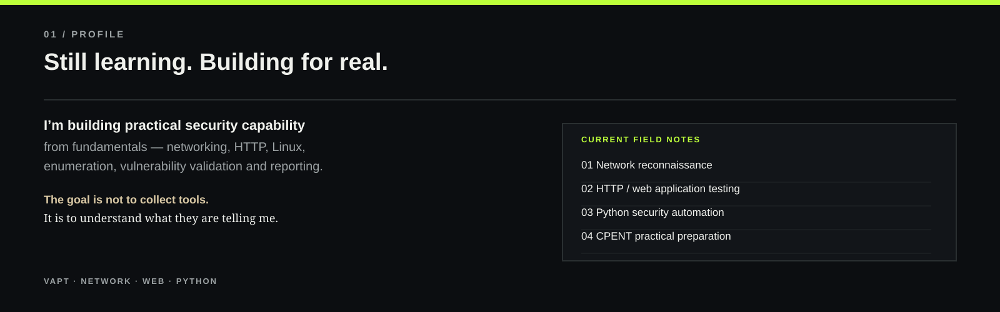
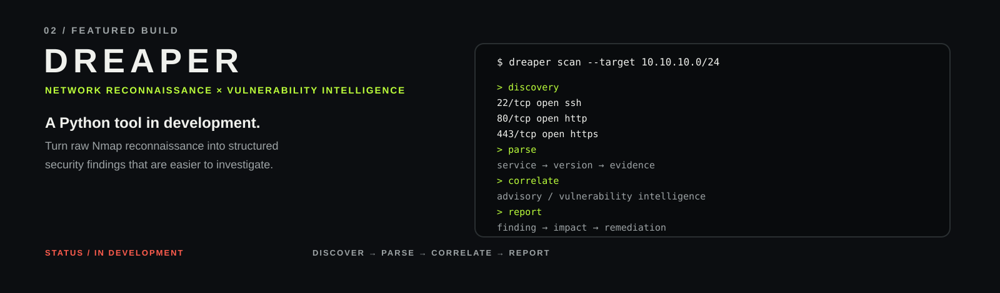
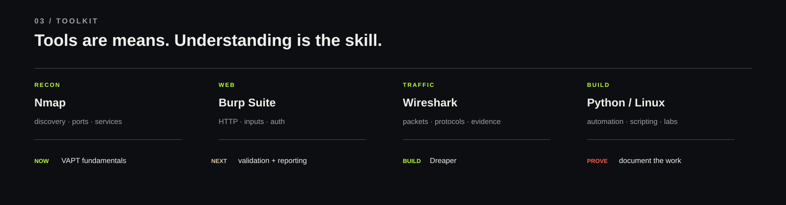
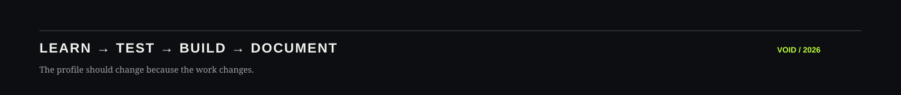

<a href="https://www.linkedin.com/in/aaron-anil-p-7900ba234/">LinkedIn</a> · <a href="https://github.com/void-hz">GitHub</a>

 

## 01 / PROFILE

I’m building practical cybersecurity capability around **network security, web application security, vulnerability assessment and security automation**.

I learn by understanding the system first, then testing what I understand in controlled environments.

**Current focus**

VAPT · NETWORK ENUMERATION · WEB SECURITY · PYTHON AUTOMATION · CPENT

 

 

## 02 / FEATURED BUILD

### DREAPER

**Network reconnaissance × vulnerability intelligence**

Dreaper is a **Python tool in development** for turning Nmap reconnaissance into structured security findings.

Current direction:

**DISCOVER → PARSE → CORRELATE → REPORT**

The project is being developed around authorized lab and assessment workflows. Example data shown in project materials is synthetic or documentation-only.

<a href="https://github.com/void-hz/void-hz/tree/main">View the work →</a>

 

 

## 03 / TOOLKIT

| Area | Working knowledge |
| --- | --- |
| **Reconnaissance** | Nmap · discovery · ports · services · version enumeration |
| **Web Security** | Burp Suite · HTTP · authentication · authorization · OWASP methodology |
| **Traffic Analysis** | Wireshark · packets · protocols · evidence |
| **Systems & Automation** | Linux · Python · Bash fundamentals |

### Learning direction

**NOW** — VAPT fundamentals  
**NEXT** — vulnerability validation + reporting  
**BUILD** — Dreaper  
**PROVE** — documented lab work

 

 

## 04 / KNOWLEDGE

**NETWORK**  
TCP/IP · OSI · DNS · HTTP/HTTPS · SSH · FTP/SFTP · SMB · LDAP · Kerberos

**APPLICATION SECURITY**  
HTTP request/response analysis · authentication · authorization · vulnerability validation · security reporting

**SYSTEMS**  
Linux · Windows fundamentals · Python · Bash

---

## 05 / CERTIFICATION PATH

**CEH** — Completed  
**CSA** — Completed  
**CPENT** — Pursuing

> Certificates are milestones. The real target is being able to demonstrate and explain the underlying skill.

---

### LEARNING → TESTING → BUILDING → DOCUMENTING

*This profile should change because the work changes.*

